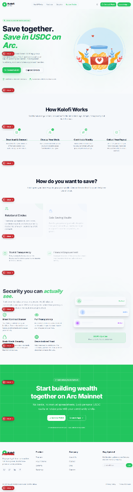
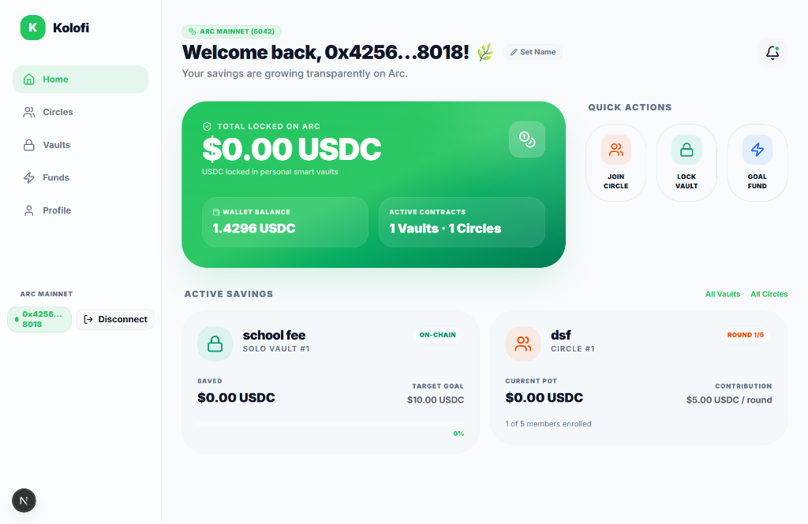

# Kolofi

### Save together. Save smart on Arc.

Kolofi is a non-custodial savings app for personal goals and community saving circles, deployed on **Arc Mainnet**. It brings familiar Esusu / Ajo (ROSCA) savings patterns on-chain with native USDC for both saving and gas.

> This project is being built for the [Arc Microgrants](./ARC_MICROGRANTS.md) program. It is a working proof of concept, not a promise of returns or a regulated financial product.

## What is live

- **Solo goal vaults:** lock native USDC toward a savings goal and withdraw when the contract conditions are met.
- **Rotating circles:** create or join a fixed-contribution group where the pot rotates through members.
- **On-chain state:** dashboard balances, vaults, circles, contributions, and payouts are read from Arc contracts.
- **Wallet-first access:** connect an EVM wallet such as MetaMask, Rabby, or WalletConnect and switch to Arc Mainnet.
- **Mobile-ready app:** responsive dashboard navigation, touch-sized controls, and a mobile bottom navigation experience.

## Arc Mainnet deployments

| Contract | Address | Explorer |
| --- | --- | --- |
| `ArcVault` | `0xa7Bb4C5EE3aB4601f38aFDB34823EeD376684a8E` | [Open contract](https://explorer.arc.io/address/0xa7Bb4C5EE3aB4601f38aFDB34823EeD376684a8E) |
| `ArcCircle` | `0x772668c219B6D35168DA2389cbda5Ca37827d604` | [Open contract](https://explorer.arc.io/address/0x772668c219B6D35168DA2389cbda5Ca37827d604) |

| Network detail | Value |
| --- | --- |
| Network | Arc Mainnet |
| Chain ID | `5042` |
| RPC | `https://rpc.mainnet.arc.io` |
| Gas asset | Native USDC |
| USDC decimals | `18` |

Arc uses native USDC as its gas currency. That means a user can contribute, lock savings, and pay transaction fees with one asset, without a separate ERC-20 approval flow or volatile gas token.

## Product screenshots

### Landing page



### Connected dashboard



Additional network and brand assets are available in [docs/screenshots](docs/screenshots/).

## Repository structure

```text
Kolofi/
├── contracts/
│   ├── contracts/
│   │   ├── ArcVault.sol       # Personal goal vault
│   │   └── ArcCircle.sol      # Rotating savings circle
│   ├── scripts/deploy.ts      # Arc deployment script
│   └── test/Kolofi.test.ts    # Hardhat contract tests
├── Kolofi-client/
│   ├── src/app/               # Landing, auth, dashboard, vaults, circles, funds
│   ├── src/components/        # Brand, wallet, navigation, landing, and UI components
│   ├── src/lib/web3/          # Arc chain config, ABIs, and contract helpers
│   └── public/                # PWA assets, animations, and Kolofi logo
├── docs/screenshots/           # Product screenshots
└── ARC_MICROGRANTS.md          # Program context and submission notes
```

## Run locally

### Smart contracts

```bash
cd contracts
npm install
npm test
npm run compile
```

To deploy, configure the private key and network settings expected by `contracts/hardhat.config.ts`, then run:

```bash
npm run deploy:arc
```

Deployment requires a wallet funded with a small amount of native USDC on Arc for gas.

### Web app

```bash
cd Kolofi-client
pnpm install
pnpm dev
```

Open [http://localhost:3000](http://localhost:3000), connect a wallet, and switch it to Arc Mainnet (`5042`). Contract addresses and client configuration live in `Kolofi-client/src/lib/web3/` and the relevant environment variables should be supplied through `.env.local` for a local deployment.

Useful commands:

```bash
pnpm lint
pnpm build
pnpm start
```

## How it works

1. A user connects an EVM wallet on Arc Mainnet.
2. The user creates or joins a circle, or creates a personal vault with a goal.
3. Contributions are sent as native USDC directly to the relevant contract.
4. Contract state controls membership, rounds, locks, withdrawals, and rotating payouts.
5. The frontend reads the resulting state and links users to the Arc explorer for verification.

## Current status

- [x] `ArcVault` and `ArcCircle` implemented and deployed to Arc Mainnet.
- [x] Hardhat test suite included for contract behavior.
- [x] Wallet connection and Arc chain configuration wired into the frontend.
- [x] Dashboard, vault, circle, fund, and profile flows implemented.
- [x] Responsive landing page and app navigation for desktop and mobile.
- [ ] Independent security audit.
- [ ] Production monitoring and a formal recovery/support process.

## Arc Microgrants context

Kolofi is a small, working Arc-native proof of concept for transparent community savings. The project is aimed at the stage where a deployed experiment needs real builders and users to test the core loop: saving together, tracking progress, and distributing funds through contracts rather than a central operator.

The Arc Microgrants program offers twenty $500 USDC grants for deployed proofs of concept, demos, and technical experiments. Submissions close **October 14, 2026 at 23:59 ET**; decisions are issued by **October 21, 2026**. See [ARC_MICROGRANTS.md](./ARC_MICROGRANTS.md) for the full brief.

## Risks and disclosures

Kolofi interacts with smart contracts and a live blockchain. Smart contract bugs, wallet mistakes, network interruptions, unavailable RPC services, and transaction errors can result in permanent loss. Native USDC is required for both savings actions and gas. Review the contracts and verify transaction details before signing.

This repository is an experimental software project. It is not financial, legal, tax, or investment advice. Kolofi does not promise returns, custody user funds, or guarantee the availability, accuracy, or continuity of Arc or any third-party service. Users are responsible for compliance with the laws and rules that apply to them.

## License

MIT
